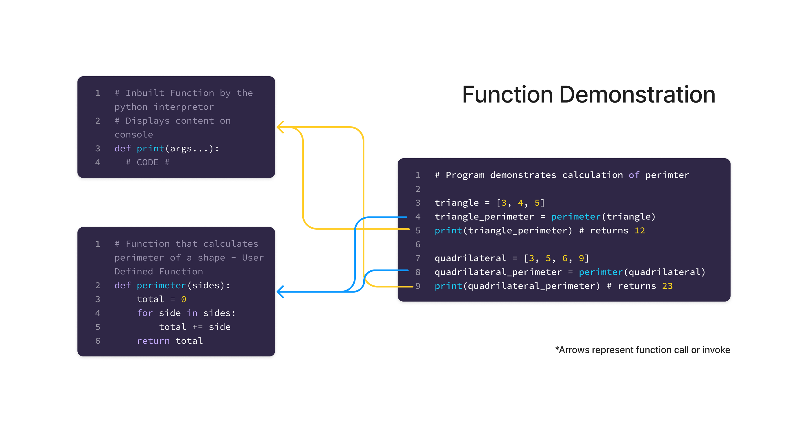

# Functions
A **function** is a block of code that can be reused over and over again, rather than writing it multiple times. 
When a **function** is defined it can be **called** any number of times. A function probably requires some inputs (or called **parameters**) process them and returns a value

### Syntax

    def <function_name> (arguments...):
    	 # TODO : Code Block
    	 return <value>

### Types of Function
1. In-Built Functions
	- Functions that are pre-defined by the interpreter. 
	- Example : print(), sum(), abs(), ord() etc [Know More](https://docs.python.org/3/library/functions.html)
2. User Defined Functions
	- Functions that are defined by the user or the programmer
	- Example : lambda x: x * 2

### Ways to Invoke Function
1. Normal Function call
	- A function is used called or invoked by using its name
	- Example: hello()
2. Recursion Function Call
	- A function which calls itself until it meets the condition
	- Refer to factorial function
3. Callback Function 
	- A function that excepts name of another function as argument and can be called or invoked inside the current function
4. Lambda Function
	- A lambda function is a small anonymous function, that can take any number of arguments, but can have one expression

### Parameters
Parameters in a function are inputs to the function
Types of parameters for a function
1. No Parameter
	- Function that does not need any input or parameter to return a result
2. With Parameters
	- Function that needs inputs or parameters to return a result
3. Default Parameters
	- Functions whose parameters have a predefined value; it is not necessary to pass the value to the function when called or invoked
4. n number of Parameters
	- Function that can accept any number of arguments ranging from 0 to n, and returns a result
